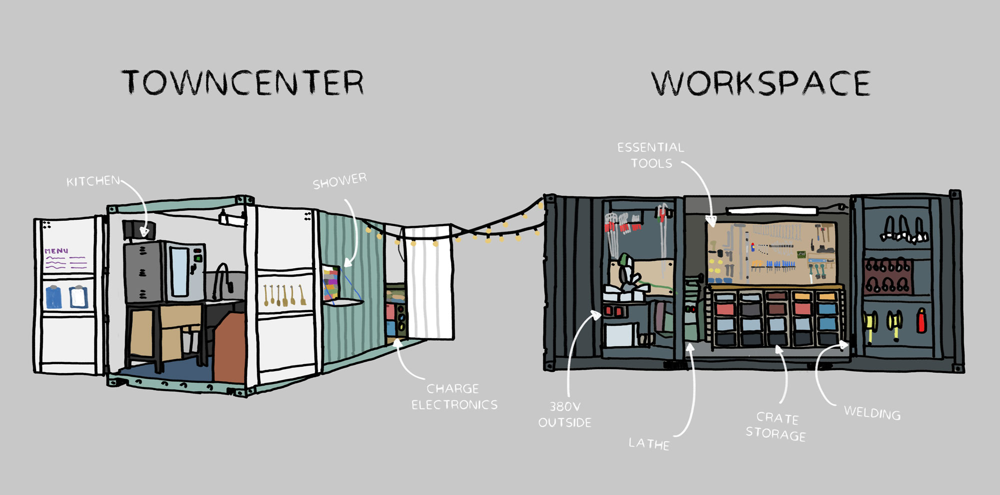
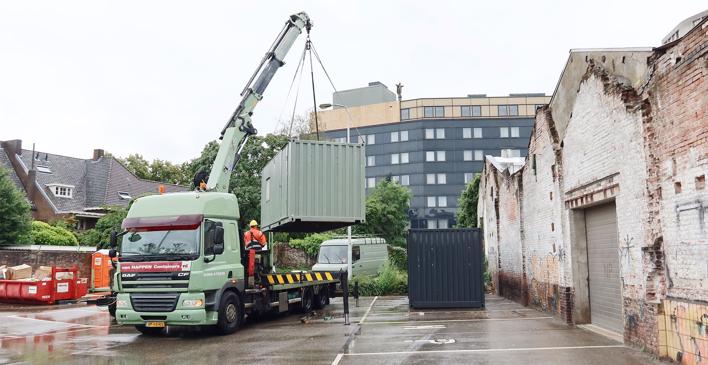
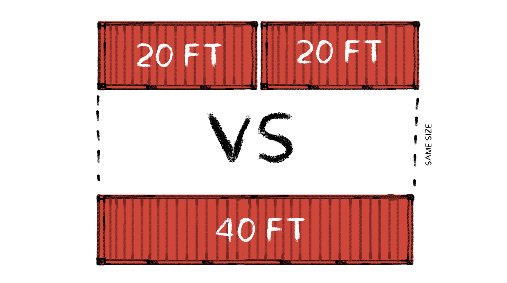
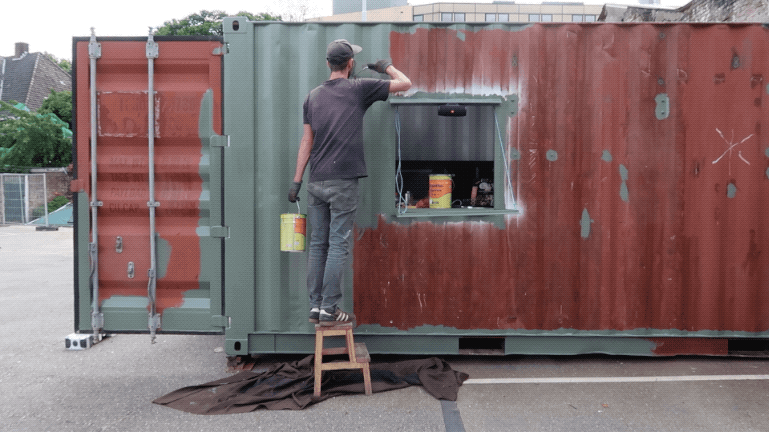
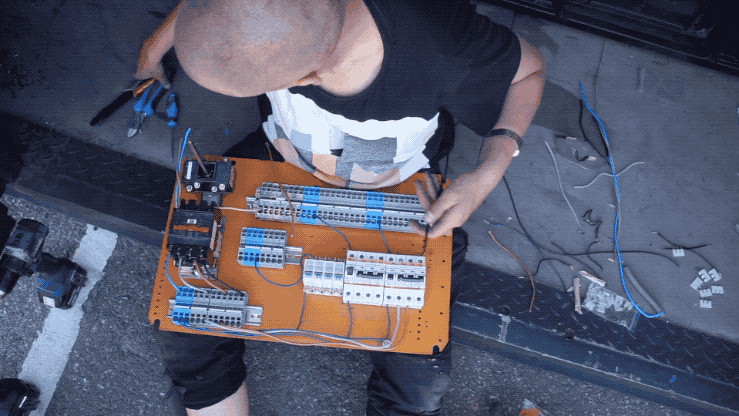
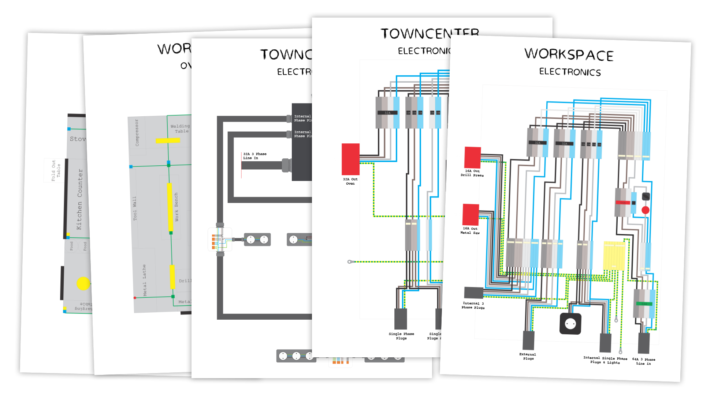

  <iframe width="800" height="400" src="https://www.youtube.com/embed/bjU7QKcEUFY" frameborder="0" allow="accelerometer; autoplay; encrypted-media; gyroscope; picture-in-picture" allowfullscreen></iframe>

We will show you how to get your basic utilities ready to move to a piece of land and setup a Basekamp. This way you can work right away and use all the tools and equipment you need. Not worrying about the basics, this will help to focus on restoring the land as a first priority. We see the Basekamp as a rough but functional starting point to grow from. We converted our basic utilities into two shipping containers! Workspace & Towncenter like in [Age of Empires](https://bit.ly/2Z5vidU).

# Workspace and Towncenter utilities
A Basekamp will be shaped a lot by where you are going and where you are coming from. For instance whether you are moving to a hot/cold/windy climate will effect the tools you need. What you were doing before might effect the things you want to bring, perhaps you already own a lot of tools, big kitchen equipment, maybe you even have a swimming pool you want to carry with you. It's all possible and depends on your needs. In our case, we wanted to bring our workspace tools and all our kitchen equipment. We decided to split them up into two different shipping containers. One called the Workspace, this contains everything to run a workspace. One called the Towncenter, which contains all the other basic human utilities.

|      Towncenter       |        Workspace     |
|-----------------|---------------------|
|  🍳 Kitchen  |  🛠 Tools |
|  👕 Washing Machine  |  🔩 Bolts & nuts |
|  🚿 Shower  |  📐 Metal Lathe |
|  🥦 Fridge  |  ⚙️ Metal/wood chopsaw |
|  📚 Books  | 🎻 Grinders  |
|  🔌 Laptop/phone charger  | 💥 Welding machine  |
|  🍫 Bulk Food | ⚡️ Electronics  |
|  🎥  Camera equipment  | ⛑ Safety equipment |
|  🔥 Hot water |   |

# Why shipping containers?
Setting up a Basekamp in a container has a few upsides. What makes it very suited for the job is that you can easily move them around. You can fully prepare them at you original location, prepare yourself properly. Set it up with your own tools, in your own place, where you know the area and places to get material. You can fully prepare yourself and then transport it to a remote area with little resources available. Plus a container is standardised, around the world. If you say you are transporting or delivering a container people know what you mean. Wherever you are. So it's much easier to find local transport, prepare roads, find a crane etc. People know how containers work and how to deal with them.

# Why 2x 20ft containers and not 1x 40ft?
You could setup your Basekamp in one big (40ft) shipping container. Plenty of space. They are generally even cheaper to get (you only need to buy one container instead of two) and we [worked with them before](https://www.youtube.com/watch?v=Pf-foTVBmMQ), we love them. But for a Basekamp you might want to think twice.

- Maneuvering: It can be hard to move big containers around, specially in rural, dirt road small corner areas. Having one big 12 meter metal container to move is more complex than two smaller ones.
- Weight: The container will be stuffed with machines, tools, equipment etc. They will become heavy, and one big container will likely become twice as heavy. To load and offload this container you generally need bigger equipment, which again might be harder to find in rural areas.
- Separating space: A kitchen and Workspace are two completely different spaces. Which ideally are not combined, you don't want grinder sounds or welding fumes in your kitchen and no boiled tomato sauce and humidity in you workspace. Having two containers helps to isolate their work from each other.

# Convert the containers
Here is where it gets fun, modifying the containers. There is a lot of inspiration to find on this topic (YouTube: container house), really a lot. And since the container is basically a metal box you can do almost anything with it. Windows anywhere, add doors, add a wall etc. The design will depend a lot on where you are going and what you are putting inside. In the end it's a very personal choice how to install everything, but there are a few tips.
- Floorplan: It's hard to squeeze a lot into a small space, but it pays off to do the extra puzzling.
- Use outside space: You might be moving to an area where you will work more outdoors, use this to your benefit. Keep the essential tools inside so they stay safe and dry. But try to do the actual work outside, under a tent. (We actually see our workspace more as a toolbox, a big box that hosts our tools and we work somewhere else).
- Metal walls: this is just genius. You can weld and bolt anything on the wall and ceiling, easy and super strong. Try to use this to your advantage. Also magnets are great to use!

# Plug and play
We built the container in a way that everything is connected, water, electricity, sockets, lightsa and water taps. It takes quite an amount of effort to wire everything up instead of just putting it in the container. But in the end you want to create a useful space, and back home you probably have better tools and equipment to do this job. So we recommend to do as much as you can back home, so once you arrive at a place, you sort out your water and electricity, hook it up (like a giant toaster!) and they're ready to go! [Here](/academy/support/download)  you can find the schematics of our containers, yours looks probably different, but it might give you an easy start. Good luck!

**💬 If at this point you have any questions, want to meet like minded people or want to share an idea you have for your container 👉 visit our [community chat](https://discord.com/invite/SSBrzeR) on Discord**
