

  <iframe width="800" height="400" src="https://www.youtube.com/embed/xOq4OWf8ecI" frameborder="0" allow="accelerometer; autoplay; encrypted-media; gyroscope; picture-in-picture" allowfullscreen></iframe>

Specially the early days of setting up a community its hectic. Making sure there is water, workspace is being setup, the kitchen is running, showers work. Long days, a lot of physical work, it's tiring. You are working on the shared facilities and infrastructure for the community. And you don't want to spend too much time thinking about your individual place to sleep. However a good night rest is crucial. Luckily this is something you can prepare in advance, you can make it easier on yourself by living in a Van. Take your comfort with you.

# Why a van makes sense?
One of the goals of setting up a community is to share facilities. Not owning everything individually. This is already very noticeable when you convert your house into a van. You realise you don't need much. You share the shower, kitchen, toilet, chill space etc. You basically only need a bed and some personal storage. This makes it very easy and doable to live in something as small as a van. There is plenty of space to make it comfortable for yourself. It's basically just your bedroom.

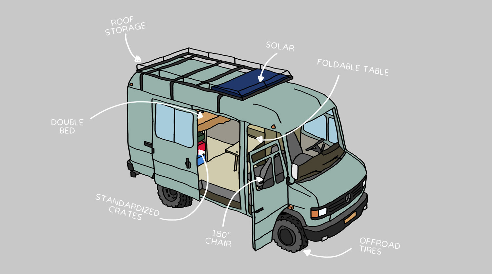

# Get Started
The biggest challenge is figuring out which kind of Van and which size. This is a very personal choice, are you tall, have a lot of stuff, pay a lot in road taxes etc. But besides this it's also good to take in account where you use if for and how much you are driving. Because there are a few different ways to go about this

Van | Type  | Pro | Con|
--- | ---| ---| ---
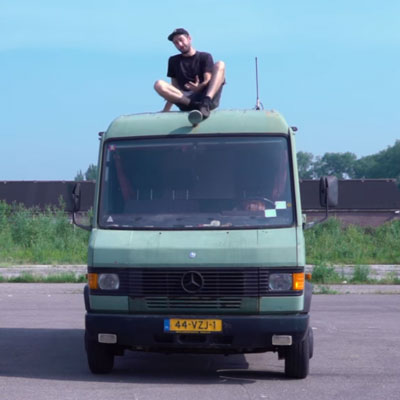 | __Old & Refurbished__   Save materials| - Reuse materials   - More durable  - Easier to repair  | - More taxes  - Fuel intense  - Less comfortable   |
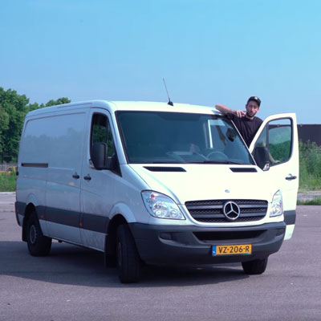 | __New & Efficient__    Save fuel| - Comfortable  - Less noise  - Easier to find  - Less fuel usage | - Support consumption  - Harder to repair
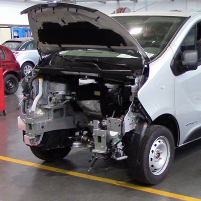 | __Old & Converted__   Save fuel & material| - Best of both worlds  - Reuse materials  - Low on fuel   |- Expensive   - Very new technology  

## Choose your type of Van:
__Old & Refurbished:__ If you are not going to drive a  lot and spend most of the time in one place this is a good option. You reduce the consumption of new cars and use existing resources as long as you can. But when you drive a lot other options make more sense

__New & Efficient:__ If you plan to still drive a lot with the van it makes more sense to buy a more efficient newer model or even electric if available. This saves a lot of fossil fuels being burned on a regular base

__Old & Converted:__ This is an exciting method, take an old Van with all it's materials and only replace the parts that are outdated (engine and fuel) and swap this with more efficient technologies like electric. However you still need to get new batteries, motors and converters and it will take a lot of your resources to implement. Probably only really worth it if you plan to drive a lot.

# Find a (service) Van
It's not hard to find a van, you can find them at your local dealer or the internets. However one source word mentioning is old Government service trucks. From the army, police, fire department etc. They usually have driven very little kilometres, spend most of their time inside and have very good maintenance. And governments tend to pick car brands which are durable (saves them effort in maintenance) So they use models which are common or that have a lot of spare parts available. So easier to repair and maintain. They are not always easy to find, but worth to give a try.
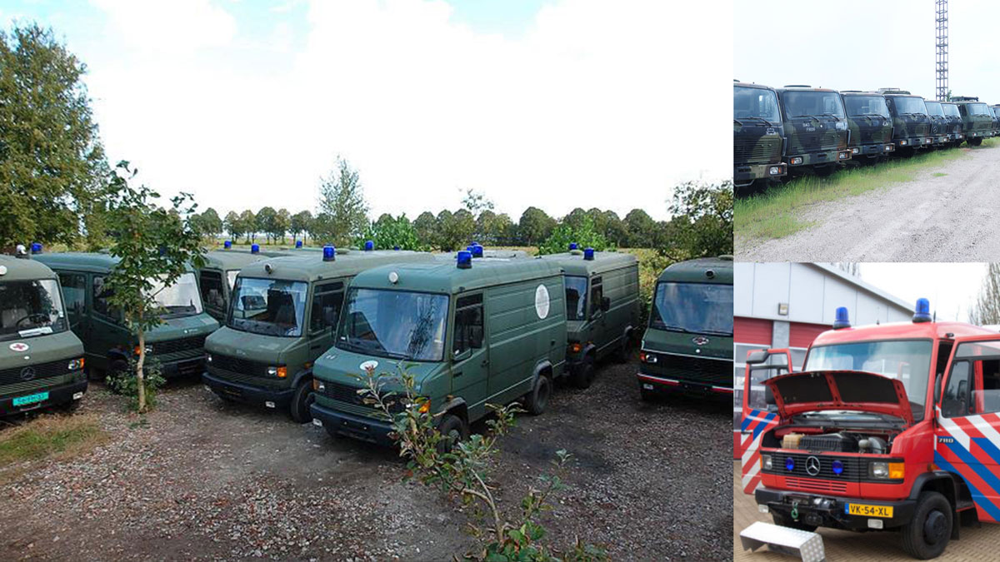

# Turn it into a home
This the fun part, turning your van into a little house. There are many different ways to do this, many videos, instagram accounts. We won't got to much in depth here but advise to just browse around on the web #vanlife. So many clever simple, smart solutions to make your life more efficient and comfortable. But it is also easy to get lost in this, thinking you need it all. We advise to start living in their fast, camp out a few weekends on your parkingspace. See what works for you, where you care about. Before ending up building a lot of things you don't really need.

> ⭐️ **Tip:** It's easy to get lost in thinking what you need. Best is to start living in it an adapt as you go

# Be off grid
Being "off grid" is a great benefit for your house. Specially when using it as a temporary house in your community. Technically you are not really off grid, because you will still use the other shared infrastructures from the land (toilet, shower kitchen etc). So let's call it an off-grid bedroom. The upside of this is you can park it anywhere on your land and not have to worry about hooking it up to electricity and dragging cables around. Charge your electronics, read a book at night, put on some music. It gives you more freedom and nowadays it's relatively easy to do using solar.
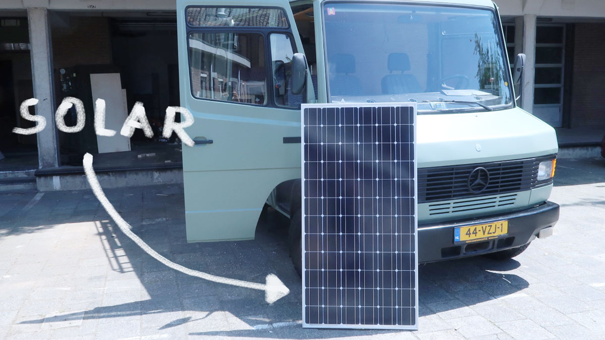

# Wiring Electronics
Solar panels work on low voltage, so do cars. So this makes it quite friendly to work with. There are a few things to take in account thought:
- Because you work with low voltage, you have a higher amperage. So for energy intense connections you need thicker cables then the usual ones you find in your 230V house.
- Having a separate "household battery" is useful. In this way you can drain your household battery but still be able to drive away on your car battery
- Most cars are running on 12Volts, however bigger vans or trucks run on 24Volt. For instance this army van is 24Volts.
- You can setup your solar system in 12V and 24V. Using the same voltage as your vehicle has the upside that you could also hook it up to your alternator. So you can also charge everything while you drive (without converting again)

## Components in this van

Item | Type of item  | Extra information
--- | ---| ---
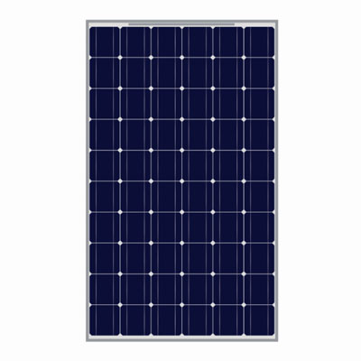 | __Solar Panel__   210 Wp  1580x808×35mm|  The solar panel is mounted on the roof.It provides a 44,36V open clamping voltage. In order to regulate the output of a panel and not kill your battery you need a controller.  |
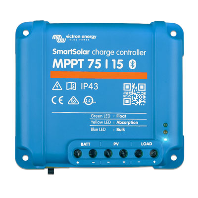 | __Controller__    MPPT 75/15  14/24V| A controller gathers energy from your solar panel. They come in many shapes and sizes. Higher quality means you maximise your energy-harvest and extend your battery life.
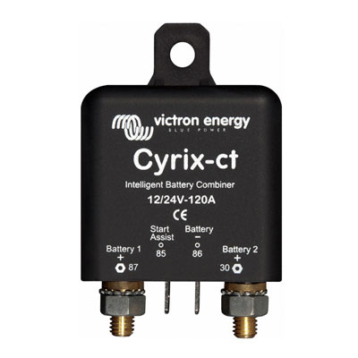 | __Intelligent relais__    Cyrix-ct   12/24V-120A  | This relais makes sure your alternator charges your car battery first, then the household.And it prevents the household battery to take power from the car battery.
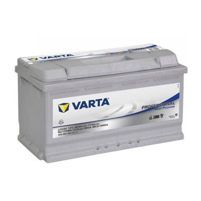 | __Battery__    12V 90Ah   2 x in series|  These batteries are specifically for caravans/campers. Having a minimal self-discharge and work well in low energy demands.

## Need inspiration?

Have a look at Mattia's van featured in [Update video #5](/academy/updates/video). It's an old German Post office Van. In the update he will give a tour, explains his best features and problems he had with it. Fun fact, his van is also in the original Project Kamp Drawing :)

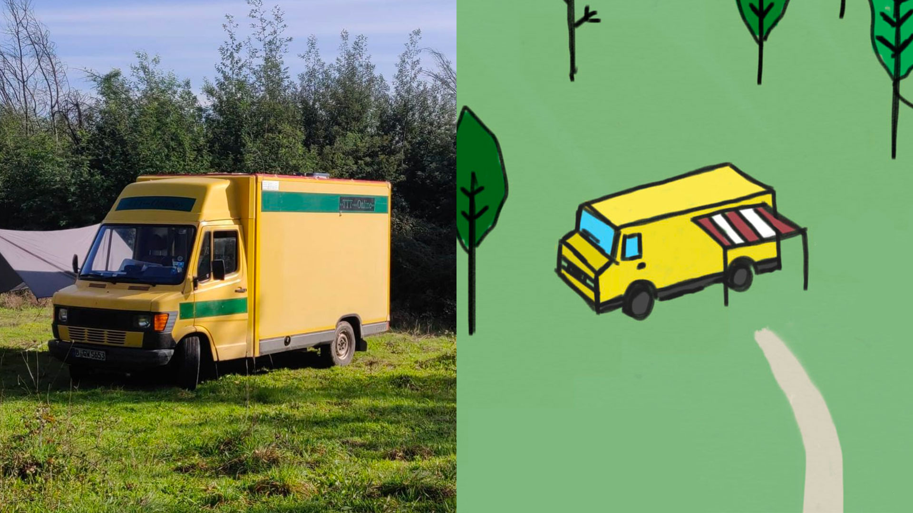

**💬 If at this point you have any questions, want to meet like minded people or want to share an idea you have for your Van 👉 visit our [community chat](https://discord.com/invite/SSBrzeR) on Discord**
