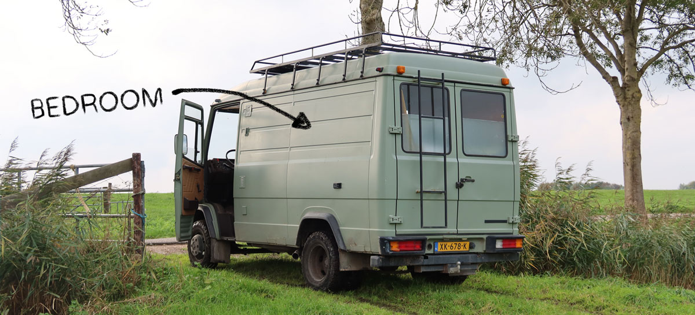
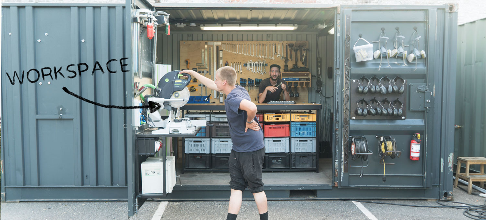
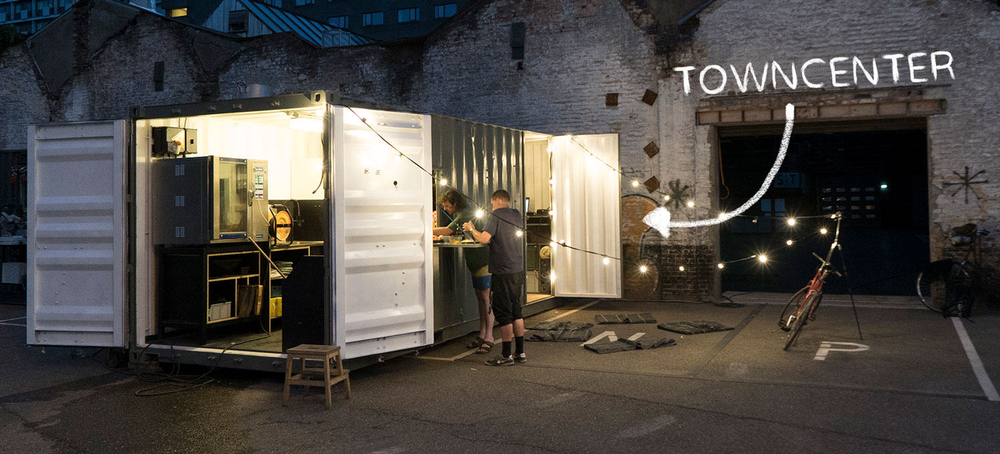

# Setting up a basekamp
In the early days there is not much on the land, no infrastructure, no kitchen, no shower, no house etc. It's hard to get something going without tools, food and a good sleep. So in order to accelerate this process we setup a Basekamp. The Basekamp was built in our previous place where we had enough tools to prepare ourselves. We put everything in shipping containers and a Van so it's easy to transport to our new location. Once arrived we plug it in to water and electricity and we are good to go. A place that hosts our basic utilities to get us going.

The Basekamp includes:
- 🛏 Bedroom
- 🍳 Kitchen
- 🚿 Shower
- 🔥 Hot water
- 👕 Washing machine
- 🔌 Laptop/phone charger
- 🛠 Workspace + tools

# House in a Van (bedroom)
Specially the early days of setting up a community it's hectic. Long days, a lot of physical work, it's tiring. Our priority in the beginning will be to setup the shared facilities and infrastructure for the community. So you don't want to spend too much time thinking about your individual place to sleep. However a good night rest is crucial. Luckily this is something you can prepare in advance, you can make it easier on yourself by living in a Van. Take your comfort with you. Fully prepare yourself back home, park it on the land and you are good for a good rest. [See how to turn a Van into a house](https://community.projectkamp.com/academy/basekamp/house)

# Workspace in a container
Tools are important to work on the land, fix machines and build structures. Having a workspace with all your tools makes development much faster. We already had a bunch of tools from our previous space and squeezed them all inside a shipping container. We actually see this more as a toolbox than a workspace, since most work will be done outside and tools are dry and safe inside the container. Inside the container you find a chopsaw, welding equipment, a metal lathe, screwdrivers, powerools, grinder, nuts & bolts etc. [Watch how to setup a workspace](https://community.projectkamp.com/academy/basekamp/container)

# Towncenter in a container
The towncenter is basically the core thing you need to sustain life (based on Age of Empires :) ).  It contains the kitchen, food supply, hot water, shower, washing machine and Laptop chargers(!). Really, the basics. This is connected to the water and electricity to get it up and running. Also this is squeezed into a shipping container. [Watch how to setup a towncenter](https://community.projectkamp.com/academy/basekamp/container)

