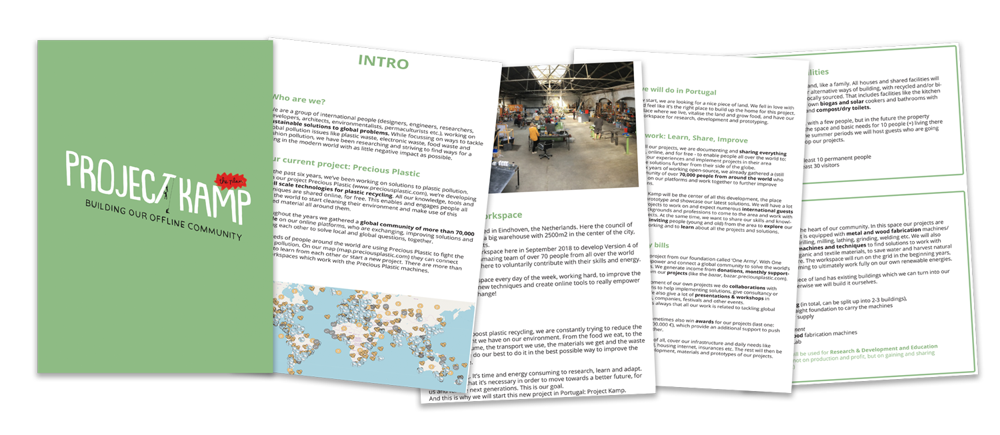
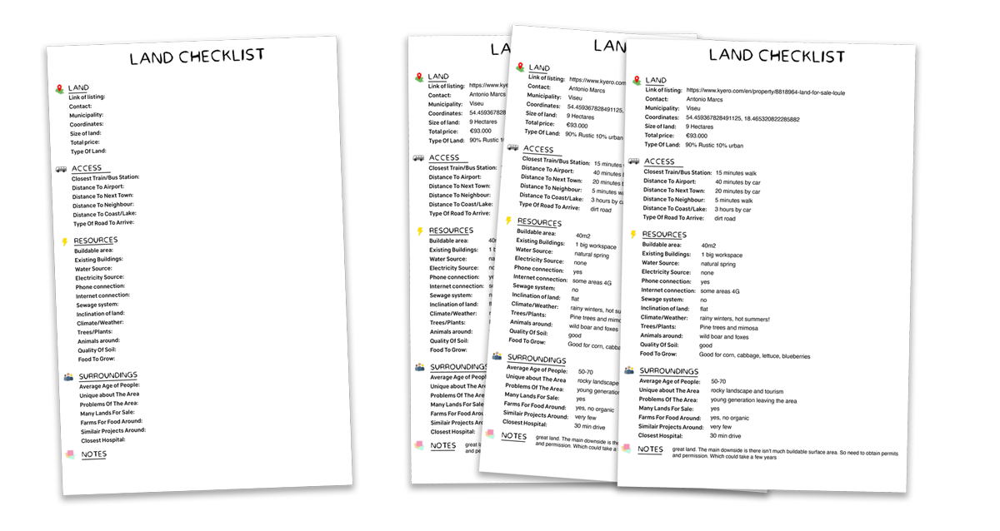

  <iframe width="800" height="400" src="https://www.youtube.com/embed/GaIBY1klcZ8" frameborder="0" allow="accelerometer; autoplay; encrypted-media; gyroscope; picture-in-picture" allowfullscreen></iframe>

# Introduction
After you have visualised that [raw idea](https://community.projectkamp.com/academy/land/share) in your mind and shared your plan with others it's time for the big thing. Finding a piece of land. In this video we will explain how to do this step by step. From researching which land you need, to actually visiting the land and finally the buying process. Seeing how to set a price, where to look out for and what additional costs you will have. Below we will also go a bit more in depth on some documents that can be useful to use.

# Documents overview
When buying land you will enter the world of documents. Documents you legally need to purchase land or documents that just make it easier to scout for lands. This is what we needed for our land in Portugal:

| Documents | Requirement | What? |   Where to get|
|----|----|----|----|
|Project Plan     | Optional  | Overview to show and share your project| Download our example
|Checklist        | Optional  | Useful when visiting and comparing lands| Download our template
|Building Book    | Mandatory | Contains all the information of the land| At current owner or municipality |
|Fiscal Number    | Mandatory | Your Tax ID (needed in Portugal)| Finance office |
|Property Tax     | Mandatory | Calculation of the taxes you pay| Made by Notary |
|Transfer ownership |Mandatory | Final agreement between buyer and seller | Made by Notary |

# Project Plan
We realised that it was helpful to have a document with information about the project, plans and needs, as a PDF to send around, or to print out and have it with us on our trips.
You can have a look at the document we made in our [download kit](https://github.com/ONEARMY/project-kamp-kit/archive/V0.1.zip) to get some ideas, here we’ll just go through the main points you might want to include:


### 1. Intro - Who are we?
Give a brief overview of your group/project. Who are the people involved, where are you at the moment, what have you been up to recently, and what are your values and goals?

### 2. What is [Project Kamp]?
Here we described what the Project Kamp (or however your project will be called) is about, so that the reader gets the overall idea. Describe what the plan and vision is and how you work. An important thing for us to mention is the open-source aspect and the community: that it’s about finding local solutions, and sharing them globally, improving and learning with a worldwide community. It might be a bit abstract, but as soon as people get the concept, they usually like it :) Also describe, how you plan to finance this project, what your income streams are - even if you don’t know exactly yet, it’s good to show that you’re thinking about it!

### 3. Project Overview
Time to go a bit more into detail! Even if you’re flexible, it helps if you define some points to make it easier to search.
- Property: In one overview, define the price you can pay, the size and type of land, the location (regions) and accessibility, and connection to public transport, what resources you need (electricity, buildings or building permits, water, trees and what you intend to use the land for).
- Housing and Facilities: Describe how you envision to live and what buildings and infrastructure the land needs to have space for.
- Workspace: Describe what space, buildings and requirements you’ll need for your work, and describe what machines and processes you’re going to use.
- Resources: We also added a section about how we plan to use and treat resources around us (like water. electricity, food and waste) with respect and care. This gives a more detailed image, and probably (hopefully) makes the thought of having you as a neighbour a positive thought :)

### 4. Benefits for the area
Now, final chance to convince whoever is reading the document, that they would like to have you around! We think that projects like this have a lot of positive points to offer to the local community. Show how the land, economy, education, and culture can benefit from what you do!

### 5. Contact details
Last point: Don’t forget to add your contact (website, email, phone number) to make it as easy as possible to reach out to you.

> ⭐️ **Tip:** Be aware you are entering as an outsider to a new region. This will affect their lifes and routines. Specially if you are doing something a bit out of the box like a community. Try to have a chat with local people, the neighbours and the municipality. See if they like your plan. It's good to have them onboard for the long term.

# Checklist for visiting lands

When visiting land you will have a lot of information thrown at you. Specially after a long day of visiting various locations it becomes hard to distinguish them from each other. And sometimes you are overwhelmed when visiting a piece of land and you simply forget to ask the right critical questions. For that reason we made a checklist, a list you take with you to every location. It answers basic questions like:
- What's the size of the land?
- Is there electricity?
- What's the exact location?
- Is it easy to access?
- etc.

You can download the checklist [in our download kit](https://github.com/ONEARMY/project-kamp-kit/archive/V0.1.zip) & see an example on how it was used. It's an interactive PDF with text boxes so is easy to fill in digitally, or you can print it out when visiting the locations. Feel free to tweak and edit the list to your own needs. Have fun :)

# Useful links
- [Pure portugal, lots of good guides to buy a land](https://www.pureportugal.co.uk/guides/)
- [Overview of tax prices in Portugal](https://www.portugalproperty.com/finance-related/taxes/)

**If at this point you have any questions, want to meet like minded people or want to share an idea you have for your piece of land > visit our [community chat](https://discord.com/invite/SSBrzeR) on Discord**
