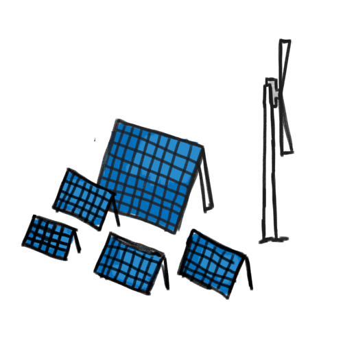
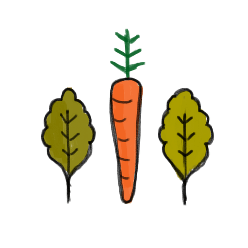
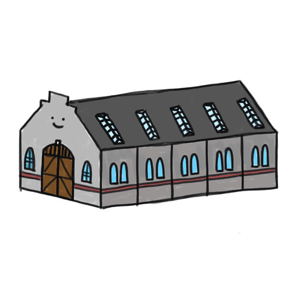
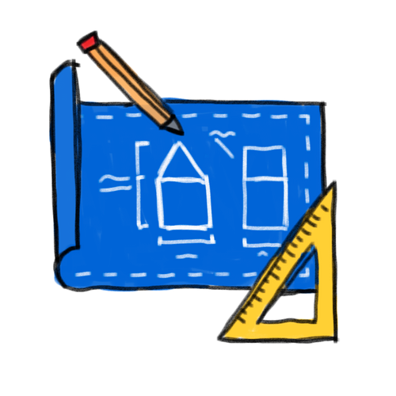
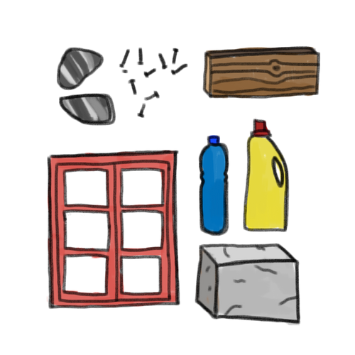
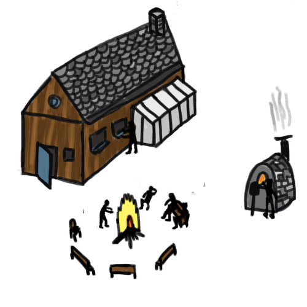

  <iframe width="800" height="400" src="https://www.youtube.com/embed/NpEaa2P7qZI" frameborder="0" allow="accelerometer; autoplay; encrypted-media; gyroscope; picture-in-picture" allowfullscreen></iframe>

For quite a while now i’m interested in building my own house. The construction sector is very polluting and uses materials that are super difficult if not impossible to recycle. And the big solid houses they construct can last a lifetime but most of them are broken down way quicker, by us. I like to try another approach, making a smaller house from biodegradable and waste materials, recycle what is already out there. And besides these logical reason it just seems like a real fun challenge. kid-dream

As you might now I like to work like this, trying to reduce the footprint we leave on earth. However throughout the years I noticed that, even if I really do my best to reduce it in daily life. I always leave a big footprint, because I’m part of this system. The stores that get my food from around the world, the packaging it contains, the electricity that is extracted from the wrong source, the streets lights that are always on, even the commute to work everyday.  Just participating in this system leaves a big footprint, specially living in the Western world. Its comfortable, but also wasteful.

I want to try out something else.
Get a piece of land. A nice piece of land, with some water and trees. And build a small house. From decent materials. With a big workspace where we work to execute projects, working on global problems. We have one big shared kitchen to eat. We harvest energy from the sun and wind. Extract drinking water from the ground and rain. We grow our food locally and keep bees. Some animals walk around for interaction and there is a big tower, just for the fun of it. We live and work in this place with like minded people. Its like our online community, offline.

|   |   |   |
|:-:|:-:|:-:|
|  we harvest our own Off the grid with electricity and water  |  we eat food that is locally grown, in the right way   |  in our Workspace we develop new projects for the world  |
|  we share what we learn, its an open source experiment  |  we build with biodegradable and recycled materials |  We live and work together to build a future world  |

**This is going to be one big experiment.**
Probably a lot of stuff will go wrong. Thats ok. See the crucial part >internet. We share everything we learn open-source online. Everyone can learn from our mistakes and copy the best things. Its a prototype for another way of living. Combining new technologies with basic needs. Work together, to build a future we dream about for our next generation.

**This is the first step, sharing the plan online.**
So people like yourself can share ideas, suggestions or tips. Next step is finding piece of land. I’m a Dutch guy, would like to live in Netherlands. Good soil to grow food and harvest energy. However many rules and regulations. Probably not flexible enough to make this happen. So if it means moving out...i’ll do it. I’ll go wherever the opportunity is.
Forward to step #2 - get a piece of land 💪
