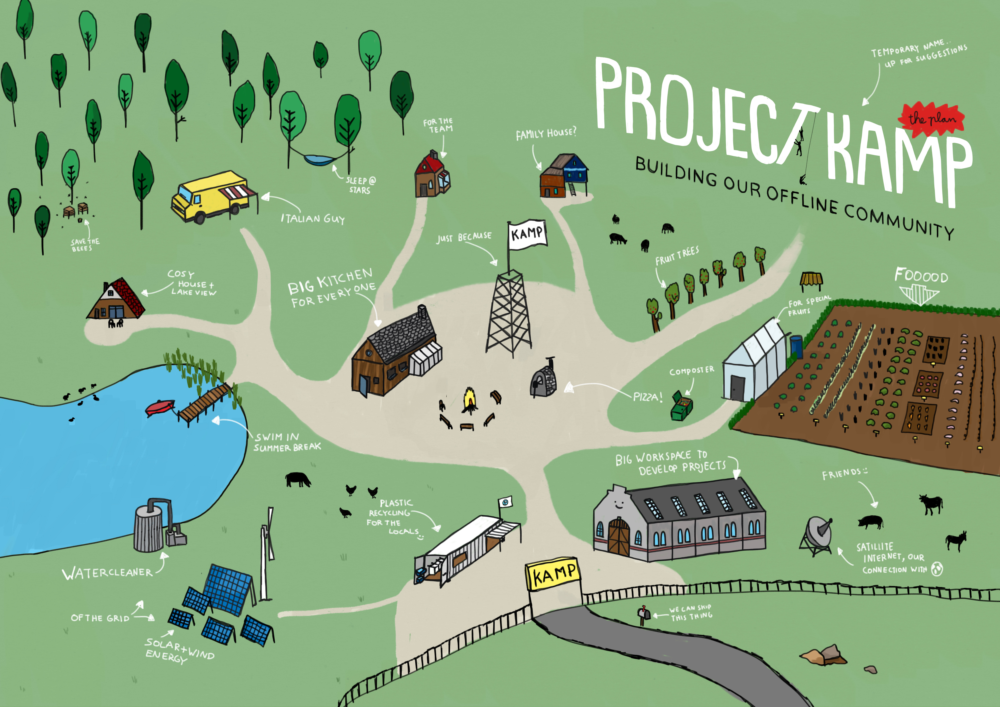

  <iframe width="800" height="400" src="https://www.youtube.com/embed/R-qZBVlsq0Y" frameborder="0" allow="accelerometer; autoplay; encrypted-media; gyroscope; picture-in-picture" allowfullscreen></iframe>

Starting a community is a big plan, you need money, build houses, fix legal paperwork etc. It can easily be overwhelming to start. But the good thing is, you are not alone. There are plenty of like minded people out there and the internet is a powerful tool to use for that. And you need that, a diverse skillset of people, engineers, chefs, gardeners, construction workers, laywers etc. So we advise as a first step to share your intention or idea. Explain what you want to do and what you need. Let others be a part of the journey.

# Videoooo 👆

We like videos, its a powerful way to share a message. You might nog be a experienced making videos or feel comfortable doing it. But you don't need much these days. Just a good storyline/ idea. Explain what you or your friends have in your head. The camera can be the thing you use on holidays or even your smartphone. Spend time writing the script, film it and share it with your friends, family and online communities with like minded people. Below a few tips to write your story:

### Tips for sharing your plan
1. Explain why you are doing this, what is wrong with the current way. Why not just buy a house?
2. Share your intention, what do you have in mind. What do you think could be better
3. Show where you are at, tell what your plan is, what you've done and what coming next.
4. End with a call to action. People are listing, if you need something, this is a good time to ask.

# Create a digital place to talk
It might take a while before you've gathered a group of like minded people, and most likely they don't all live around the corner. You can ding people in our Discord. But soon you need your own space. So creating a place to interact is crucial, whether its a forum, discord, whatsapp-group it doesn't matter. But setup a place where you can share ideas, suggestions and updates to slowly create your little team. And be patience, it might take a while. But there is probably enough to figure out and learn in the meantime anyway.

