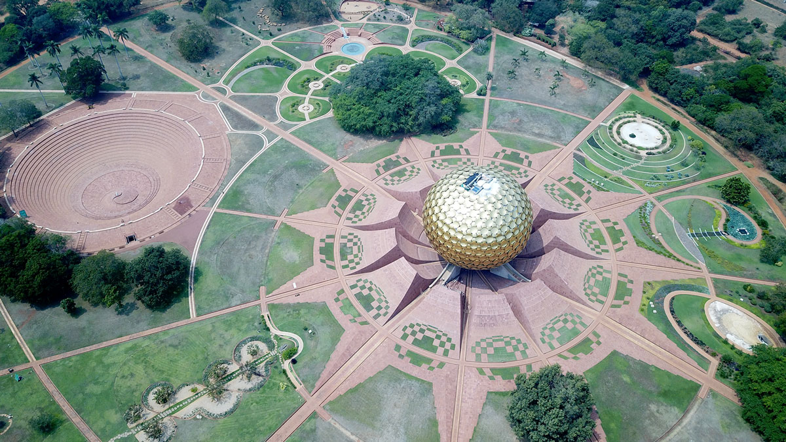
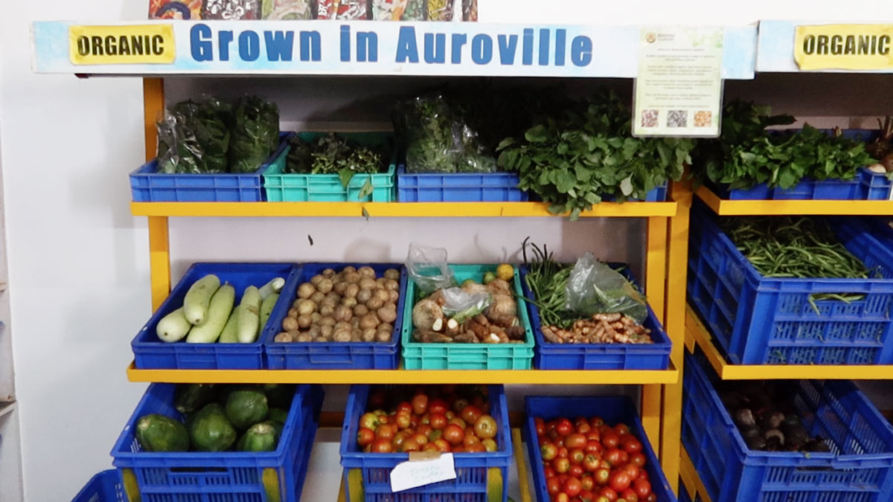

  <iframe width="800" height="400" src="https://www.youtube.com/embed/d-PgtNcByWk" frameborder="0" allow="accelerometer; autoplay; encrypted-media; gyroscope; picture-in-picture" allowfullscreen></iframe>

🇮🇳 Information Auroville  |     |
---                       | ---|
📍 Location                  | Auroville, India   |
⛅️ Local climate             | Warm. 30-40 Degrees   |
🌍 Main Nationalities        | Indian, German, French, Italian (and 46 more)  |
🚩 Established               | 1968 |
🌳 Size of land              | 1360 Hectares   |
🙂Amount of residents       | 3200 People  (aiming for 50.000)  |
⭐️ Goal                      | Create a city where people live in Unity   |
✨ Research work             | Spirituality/work on the inner self  |
🏗 Important structures      | Matrimandir, Solar Kitchen, Town hall, Visitor Centre, 18 farms, 5 schools  |
🚲 Open for visitors?        | Yes   |

# Location
Auroville is based in the South of India in the Tamil region. It's a sunny and warm climate all year around. Originally the region was quite deserted due to the amount of trees that where taken down by the British. The biggest city around is Pondicherry, many items are available here + a local airport. But for heavy industry or tools you need to drive 3-4 hours to Chennai.

# City Planning
Auroville is big, like a city. And it's setup with a plan. Designed by several architects in the 60's. The goal was to have specific areas for specifics needs, so they don't bother eachother. For instance having all the production and manufacturing in the same region. Or having a specific residentional area for living. It's roughly dived in 4 main categories and around it is a "green belt". A Green area for farms, orcharts, trees etc.

# People
There are over 50 different nationalities in Auroville, from all different age ranges. People come with very diverse intention, some like to work on spirituality, some like the part of freedom, some like to explore alternative options and some seem a bit lost. Int he past Auroville had had few problems with crime and vandalism because it's so open. But overal nice people.

# Food
There isn't one strict way of food consumption in Auroville. it depends in which sub-community you are located. Some eat vegan, some only local, some meat. It's up the the sub-community to define. That said there is one main kitchen where many people eat. The solar kitchen, originally setup the provide the community a good solid meal without having to worry about it so they can focus on work. Here still everyday 1000 meals are being cooked, all vegeterian and some vegan option available. Not fancy but nutritional.

# Energy infrastructure
Over 500KW of electricity is generated using solar panels and there are 150 solar heaters to heat up hot wtaer for houses. However this doesn't fully power the community and they are plugged into the grid. Some sub-communities are pushing this more. Testing and prototying, alternatives like biogas, direct solar cooking etc.

# Work beyond community life
Sustaining this big community is a daily tasks for most Aurovillians, working at a local community or running a business. In the evening or weekends there isn't one main place to gather but always plenty to do. You can find events and things to do everyday somewhere in Auroville. Movies, presentation, yoga classes, workshops, dancing. Drugs and alcohol is not sold and not encouraged to use.

