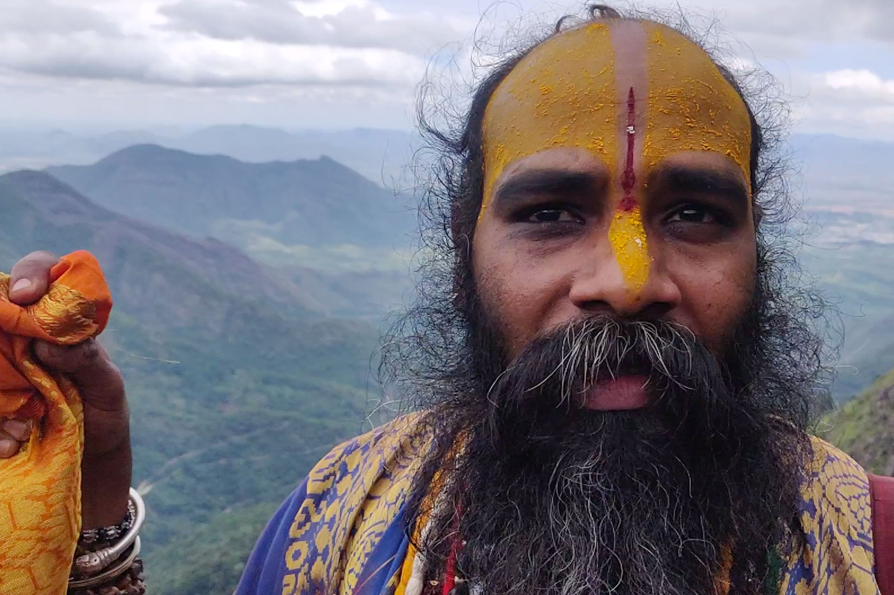

  <iframe width="800" height="400" src="https://www.youtube.com/embed/UaI1vAgV6bU " frameborder="0" allow="accelerometer; autoplay; encrypted-media; gyroscope; picture-in-picture" allowfullscreen></iframe>

🇮🇳 Information Krishna Consciousness  |     |
---                       | ---|
📍 Location                  | Worldwide  |
⛅️ Local climate             | Varies depending on location of the temple  |
🌍 Main Nationalities        | Mainly Indians, with many internationals  |
🏗 Number of temples          | 800+                                           |
🚩 Established                | Officially 1968 but dates back thousands of years |
🙏 Founder                    | Swami Sri Prabhupada|
🙂 Number of Monks            | from 1 to 400 depending on temple size|
⭐️ Goal                       | Venerating and spreading Krishna Consciousness|
✨ Research work              | Spirituality and enlightenment|
🏗 Important structures       | Mayapur temple|
🚲 Open for visitors?         | Yes, daily|
📰 More information          | [ISKCON - The Hare Krishna Movement](https://www.iskcon.org/)  |

# Location
The Krishna Consciousness has temples spread across the planet. Over 800 to be more precise. Temples can be big like the one in Mayapur hosting hundreds of monks or smaller. Temples are both located in the cities or in nature.

# People
In a Krishna temple you can find people from all walks of life and nationalities. The monks live simple but intense lives dedicated to the service of Krishna to continue a tradition of thousands of years. Visitors come to pray, learn and the daily free sacred food, Prasad.

# Food
Prasad is a food offering made to Krishna. All food consumed in the temple by the monks and visitors has to be offered to Krishna first and become purified. The food is vegetarian with a lot of rules and regulations on what can and cannot be eaten. Galic? Nop. Onion? Nein. The act of cooking also comes with a rigid set of rules.

**Non-intoxication**

Intoxication in any forms is not allowed in Krishna Consciousness. And this covers the usual drugs, opioids, smoking and drinking alcohol of course but it goes even deeper to also include coffee and black tee.  

# Spirituality
People meet in a Krishna temple to do inner work. To research and practice age old knowledge of what it means to be human and live on this planet. And for any community to thrive it seems like that understanding one self is a good first step often overlooked. Probably the foundational step for a group to build upon.

