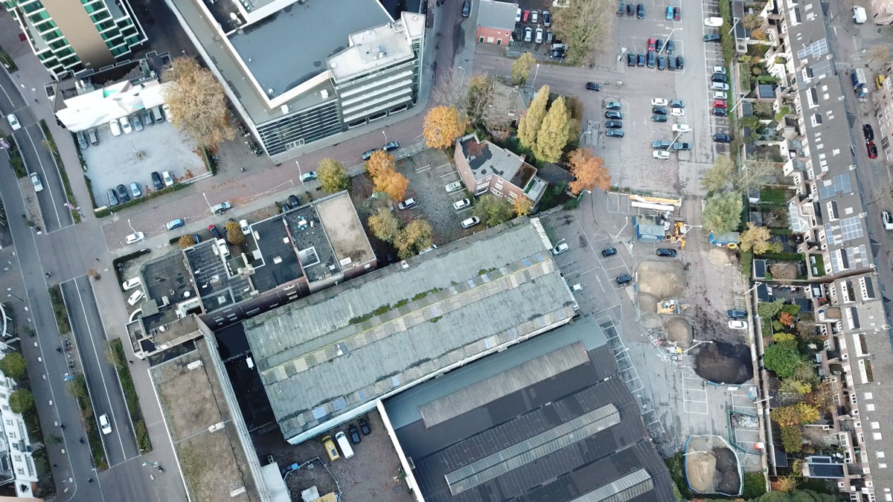
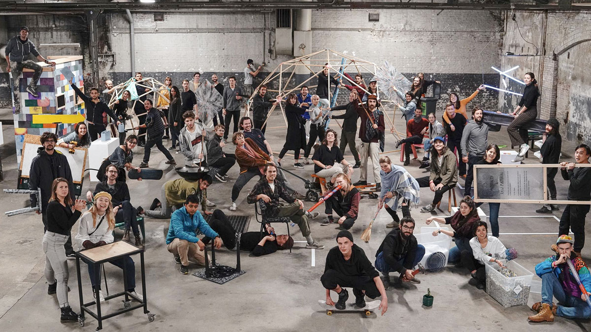
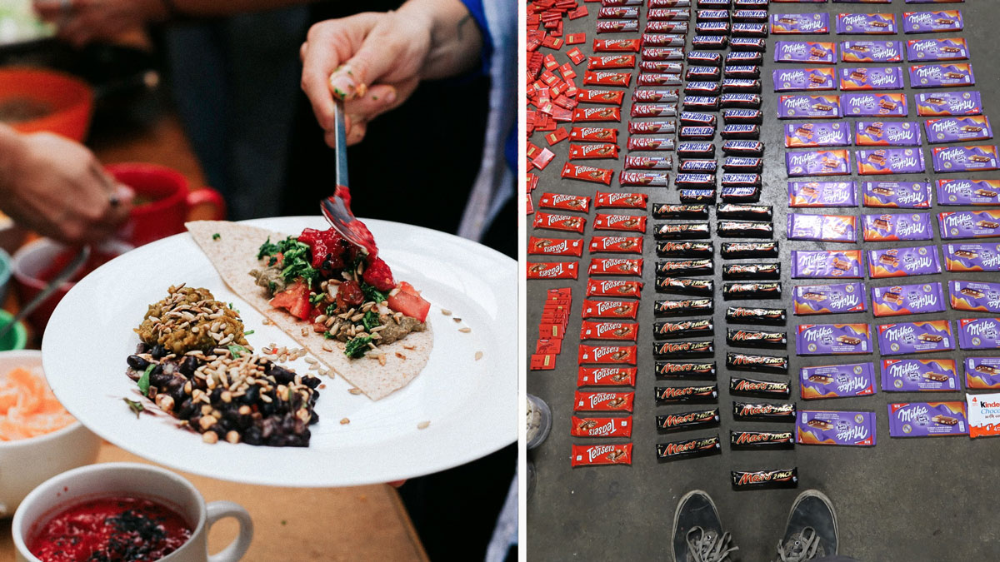

  <iframe width="800" height="400" src="https://www.youtube.com/embed/OmBv6712ZRI" frameborder="0" allow="accelerometer; autoplay; encrypted-media; gyroscope; picture-in-picture" allowfullscreen></iframe>

🇳🇱 Information Precious Plastic V4  |     |
---                       | ---|
📍 Location                  | Eindhoven, Netherlands   |
⛅️ Local climate             | Grey. -7 to 35   |
🌍 Main Nationalities        | French, Dutch, German   |
🚩 Established               | 2018 (1,5 year) |
🌳 Size                      | 1 Big Workspace + 10 Houses  |
🙂 Amount of residents       | +/-45   |
⭐️ Goal                      | Develop Precious Plastic V4   |
✨ Research work             | Prototyping machines and digital work  |
🏗 Important structures      | Tropical Bar   |
🚲 Open for visitors?        | Not anymore   |

# Location
The workspace is based in Eindhoven. A previous industrial city in the south of the Netherlands, nowadays a hun for many people that work in design. Being in an urbanised area makes it easy to get supplies, markets, hardware stores, scrapyards. However hard to find good food from local farms.

# People
In the course of a year we had 110 people helping, with an average of 35-50 people on the ground. People outside Europe could only stay 3 months due to visa regulations. The group came from around the world, new zealan, chile, kenya, malesia, russia, mexico, us, south africa etc. No one new eachother before they came, they only thing that brought them together was a passion to fix the plastic problem.

# Food
The default was to have a Vegan kitchen, trying to draw a clear line. Most people in the team are not vegan or even vegeterian. So one of the goals was to make vegan good, as an inspiring example. And meanwhile aiming to source as much organic, local and zero-waste food as possible. However the line of vegan food got more blurry when dumpsterdiving came in, people in the community don't like waste. Some people decide to eat cheese that would otherwise be thrown away. Some people went to eat also milk chocolate. And others would stick to being 100% vegan.

# A temporary community
We started with an empty workspace and a plan. Research and development was the key purpose of this project, the element that brought us all together. The goal was to develop machines to recycle plastic, not to build a community. So food, relations, infrastructure always came secondary. There was a deadline and a goal to complete. This brought a huge energy in the group, a very focussed and targeted way of working. New experts and people from around the world coming in the chip in their skills. But this also made it intense for long term (1 year) members, like running on 200% all the time. It worked out because it was a temporary community, but in the long term it would have not lasted in this way.

