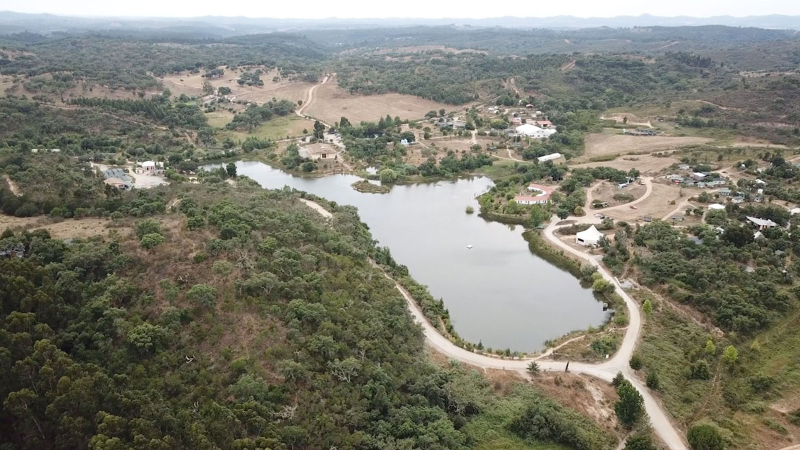

  <iframe width="800" height="400" src="https://www.youtube.com/embed/3JCEmiriV0k" frameborder="0" allow="accelerometer; autoplay; encrypted-media; gyroscope; picture-in-picture" allowfullscreen></iframe>

🇵🇹 Information Tamera|     |
---                       | ---|
📍 Location                  | Al garve, Portugal   |
⛅️ Local climate             | Grey. 20 to 50   |
🌍 Main Nationalities        | German, Portuguese, French  |
🚩 Established               | 1990 |
🌳 Size                      | 140 Hectares |
🙂 Amount of residents       | +/- 200   |
⭐️ Goal                      | Building a healing biotope   |
✨ Research work             | Heal ourselves from love and sexuality  |
🏗 Important structures      | Lake    |
🚲 Open for visitors?        | Yes during vistor days   |
📰 More information          | [Tamera website](https://www.tamera.org/)  |

# Location
The community is based in the south of Portugal. Warm climate with with mellow winters. There is a local village 15 minutes by car and some farms around. Regional food and farming is available. But besides that it's quite remote to get supplies and resources for R&D. They take a truck every now and then to go to the big city to get supplies. It's remote for European standards, because Amazon just delivers to their property.

# People
By far most people here are Germans, it's also a very common spoken languages. Probably more than English or Portuguese. The remaining nationalities are diverse, Portuguese, Israeli, French, US etc. The impressive thing here is the age-range. They have the first generation living there which are in their 60-70's and new born children. This makes the community very diverse. Young wild energetic spirits mixed with old knowledge keepers that observer the space.

# Food
One of the goals of Tamera is to create a world of abundance, a place without scarcity. You can really see this philosophy in their food. Amazing vegan meals cooked every day, food grown and harvested from their own land or farms in the region. Fruit trees everywhere around the lake. They also have a small shop that sells food. They use a diverse set of metrics to define what food is "good" metrics like: Do we support this supplier's long term vision, do they harm animals, do they regenerate their land, is it local, is it with little packaging etc. Always trying to improve their supply chain.

# Energy infrastructure
In the south of Portugal sun is in abundance, solar is relatively easy to harvest. They are working towards 100% energy autonomy.  However they are also aware of the downsides of photovoltaic energy, the lithium batteries and the dependency of high and manufacturing. So they have a specific area called "the solar village" where they explore technology to use the direct heat of the sun to cook on. Keeping the energy harvesting more basic. Besides this they are running (testing) some biogas cooking.

# Research & Development
Originally the community was doing more technical Research and Development, specially in the moments where they where setting up. They needed to figure out how to build their houses, infrastructure, roads etc. Nowadays the community is quite established, most basic infrastructure is there so there is less direct need for R&D. The biggest form of research is now on love & sexuality. How how to deal with trust, jealousy, how to structure relationships, have pure intentions etc. Trying to heal humans from the traumas they carry inside. Which would ultimately also result in improvements in our own environment. When our intentions are good and pure we will do good things.
